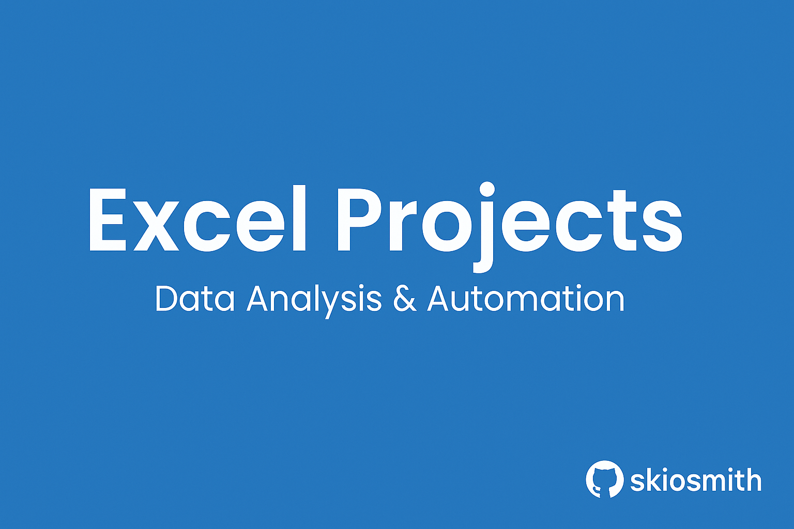

# Excel Projects Portfolio

Welcome to my Excel Projects Portfolio — a curated collection of practical projects built in Microsoft Excel. These projects demonstrate my ability to use Excel for data analysis, automation, and business problem-solving.

Each folder contains a real-world scenario, ranging from payroll calculations to performance grading systems. These projects apply key Excel functions like conditional logic, absolute referencing, and data visualization to solve tasks efficiently and accurately.

---

## Projects

### 1. Payroll Project
**Folder:** [`/payroll/`](payroll)  
A complete payroll management system built in Excel.

- Calculated employee pay using `Hourly Wage × Hours Worked`
- Applied `IF` statements to compute overtime hours and bonuses.
- Used absolute referencing for formula consistency across multiple days.
- Generated summary statistics: `MAX`, `MIN`, `AVERAGE`, and `TOTAL`
- Scaled for the entire month of January.

[See full project →](payroll/README.md)

---

### 2. Gradebook Project
**Folder:** [`/gradebook/`](gradebook)  
An employee grading system with performance tracking and chart visualizations.

- Used orientation to rotate column headers.
- Applied conditional formatting (Highlight Rules + Icon Sets).
- Used the `OR` function to determine termination conditions.
- Created charts to visualize test results and trends.
- Identified top and bottom performers at a glance.

[See full project →](gradebook/README.md)

---

## Skills Demonstrated

- Excel formulas: `IF`, `OR`, `AND`
- Absolute and relative cell referencing
- Conditional formatting
- Summary statistics
- Data visualization using charts
- Spreadsheet design and layout optimization

---

## About

**Author:** [@skiosmith](https://github.com/skiosmith)  
**Focus Areas:** Excel automation, data reporting, and real-world business analysis using Microsoft Excel.

This repository is actively maintained. More Excel projects and enhancements (including screenshots and advanced formula breakdowns) will be added soon.

---

> Feel free to explore the projects, leave feedback, or connect with me on GitHub!
