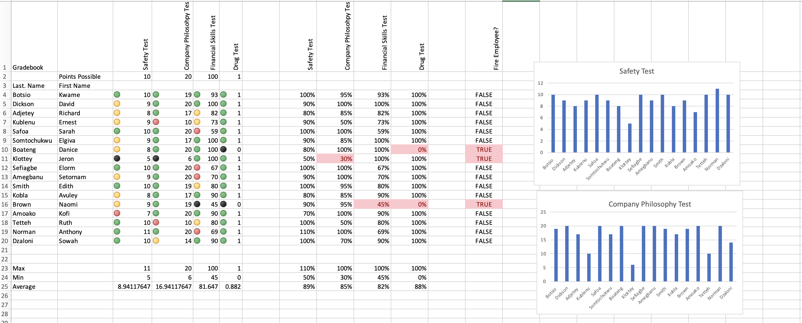
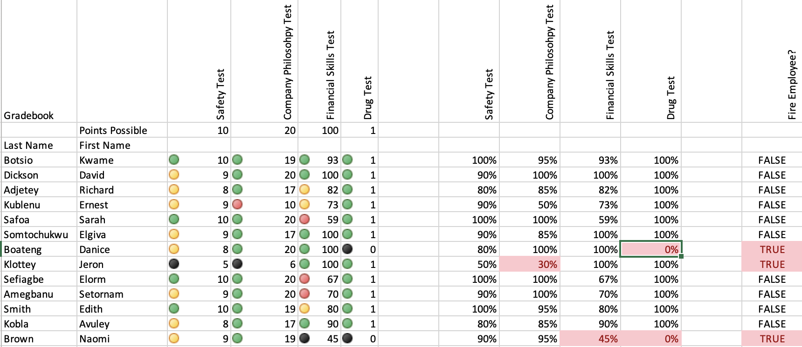
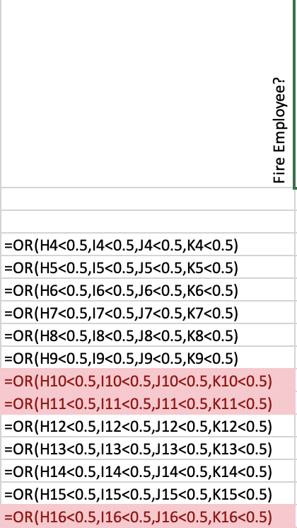
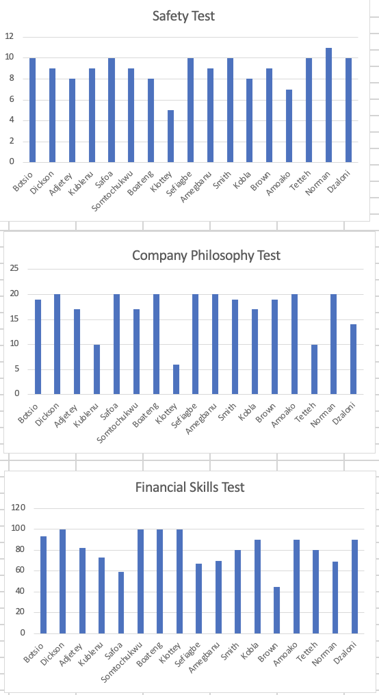

# Gradebook Project

This is the Gradebook project. In this project:

- The **orientation function** was used to rotate text in header columns.
- **Absolute cell referencing** was applied for consistent formula replication.
- **Conditional Formatting** highlighted:
  - High- and low-performing employees (using Highlight Cell Rules).
  - Performance icons (using Icon Sets).
- The **OR statement** flagged employees for possible termination based on test results.
- **Charts** were created to visualize performance across tests.

---

## Screenshots

### 1. Gradebook Main Table
This table displays employees' test scores with rotated headers for better layout.

---

### 2. Conditional Formatting
This view highlights high and low performers using color rules and icon sets to provide visual performance cues.

---

### 3. OR Statement Logic
This section shows the use of the `OR` function to determine if an employee should be flagged for poor performance.

---

### 4. Charts
Visual representation of employee test scores using Excel charts.

