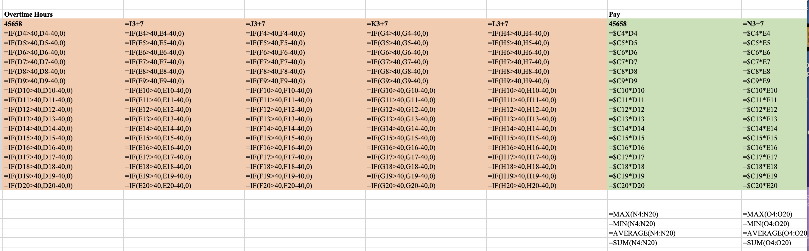

# Payroll Project

This is the Payroll project. It involved calculating employee salaries based on hourly wages, hours worked, and overtime. 
The project progressed in stages, using key Excel functions and techniques:

## Key Features:
- **Basic Pay Calculation**  
  - Computed as: `Hourly Wage × Hours Worked`

- **Summary Statistics**  
  - Calculated: `Maximum`, `Minimum`, `Average`, and `Total` pay values.

- **Overtime Calculation**  
  - Applied conditional logic using `IF` statements to determine:
    - Overtime hours (if hours worked exceeded 40).
    - Overtime bonuses.
    - Total pay including bonuses.

- **Full Month Payroll (January)**  
  - Used **absolute cell referencing** to replicate formulas across the month.
  - Applied conditional logic consistently across multiple dates.

## Skills Demonstrated:
- Logical functions: `IF`, `AND`, `OR`
- Absolute and relative cell references.
- Payroll structure and pay-based reporting.
- Excel formula automation and scaling.

This project demonstrates how Excel can be used to create dynamic and functional payroll systems for real-world use.

---

## Screenshots

### 1. Main Payroll Table
This table displays employees' hourly wages, hours worked, and their corresponding pay based on the formula:  
`Pay = Hourly Wage × Hours Worked`

---

### 2. Formulas View
This view shows the underlying formulas used to calculate pay and other values, including absolute referencing.

---

### 3. Overtime Logic
A focused section showing the use of `IF` statements to calculate overtime hours and bonuses.

---

### 4. January Worksheet Summary
This shows daily pay calculations and how the logic was scaled across the entire month using absolute cell referencing.

