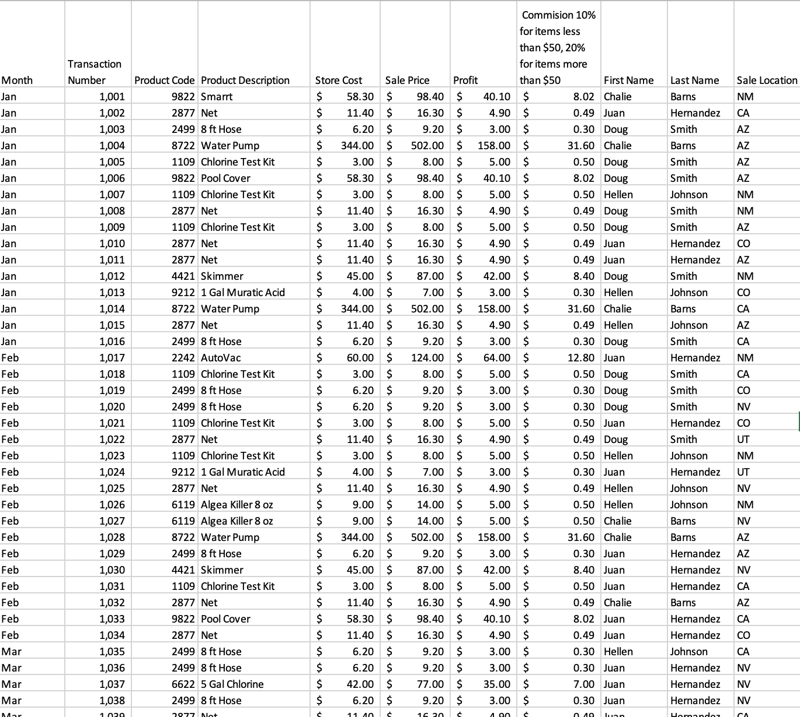
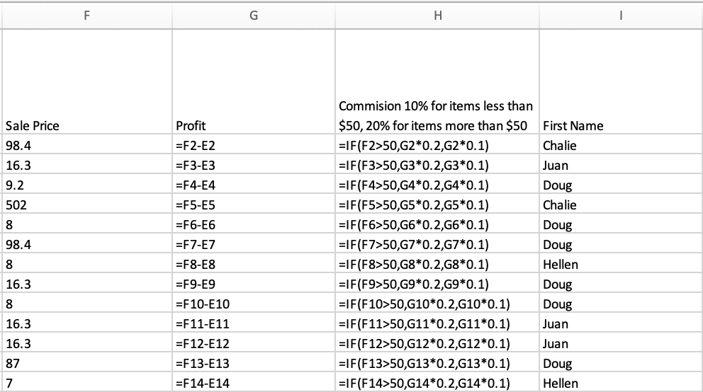
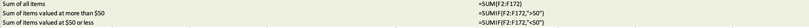
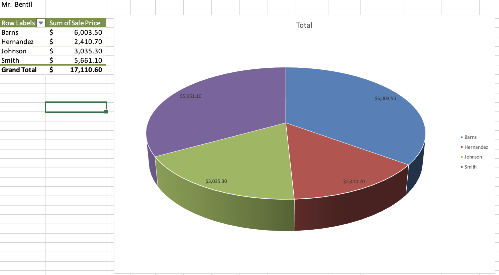

# Sales Database Project

This project demonstrates Excel techniques for cleaning, organizing, analyzing, and visualizing sales data. It’s designed to showcase core spreadsheet functions used in a business sales environment.

---

## 📊 Features & Techniques Used

- **Text to Columns**: Splitting combined data entries for clarity
- **IF Statements**: Logic to flag conditions and criteria
- **SUMIF**: Summing totals based on specific conditions
- **Sorting & Filtering**: For easier data exploration
- **Pivot Tables & Charts**: Visualizing category and regional performance
- **Conditional Formatting**: Highlighting top performers and patterns

---

## 🖼️ Screenshots

### 📌 Main Table

---

### 🔍 IF Statement Logic

---

### ➕ SUMIF Formula

---

### 📈 Pivot Table & Chart

---

## 🔗 Back to Main Repository

[⬅️ Excel Projects Main README](../README.md)
